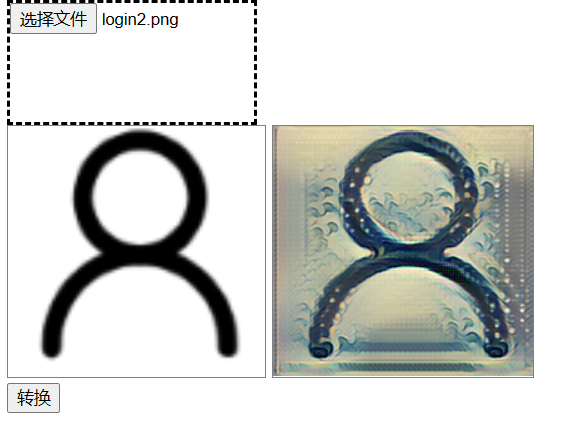

# 实验报告

**目录结构：**

```markdown
root
    -- DIR --
    css: 存放所有的.css文件
    images: 本次作业使用的图片
    javascript:
        blind-watermark: 盲水印所用的js代码
        script: 各级页面使用的js代码
        utils: 辅助js代码
    node_modules: node下载的包
    pages: 点击图片跳转到的二级页面以及功能页面
        img*.html: 图片二级页面
        *-watermark.html: 水印页面
        encryption.html: 盲水印加密解密页面
        styleChange.html: 图片风格转移页面
    -- FILE --
    index.html: 登陆页面
    main.html: 主页
    register.html: 注册页面
    mysql-init.sql: 数据库初始化
    mysql.js: node入口
    package.json: node项目的配置
    README.md
```

**需要下载的依赖：**

```json
  "dependencies": {
    "@tensorflow/tfjs": "^4.1.0",
    "bcryptjs": "^2.4.3",
    "body-parser": "^1.20.1",
    "encoding": "^0.1.13",
    "express": "^4.18.2",
    "express-jwt": "^7.7.7",
    "express-session": "^1.17.3",
    "fs": "^0.0.1-security",
    "http": "^0.0.1-security",
    "jsonwebtoken": "^8.5.1",
    "mysql": "^2.18.1",
    "path": "^0.12.7",
    "svg-captcha": "^1.4.0",
    "url": "^0.11.0"
  }
```

**实验说明：**

1. 每张图片都可以点击跳转到二级页面
2. 实现水印的图片：
    1. 左上角第一张图片img1：动态水印->基于svg的方案实现一个包含个人昵称+学号的可见水印，水印位置在图片的下面部分。
    2. img1下面的一张图片img2：频域水印->基于傅立叶变换的不可见水印：
        1. 图片的源文件是`./images/blind-watermark-source.jpg`
        2. 加密解密过程要打开`./pages/encryption.html`并上传图片进行加密解密
        3. 点击img2跳转的二级页面展示的是加密过的图片`./pages/blind-watermark-result.jpg`
        4. 在encryption中对加密过的图片进行解密可以得到水印信息`201250222 于金甲`
3. 主题切换：
    1. 实现了主题切换的一级页面：`index.html`
        在该页面中实现了两种方案的主题切换
        注意：两种方案不兼容需要使用另一种方案时要刷新页面
        两种主题分别为：白天模式、夜间模式。
    2. 基于CSS变量+类名切换的方案。
        参考[参考资料](https://mp.weixin.qq.com/s/J90TYDJGmo8KCTsawT-vIg)的方案三。
        ->对应button为[白天模式]、[夜间模式]
    3. 基于CSS变量+动态setProperty的方案
        参考[参考资料](https://mp.weixin.qq.com/s/J90TYDJGmo8KCTsawT-vIg)的方案六。
        ->对应button为[白天模式1]、[夜间模式1]
4. 登录注册功能实现：
    1. 构建数据库语句：mysql-init.sql, 构建数据库后要修改`mysql.js`中`Line32:var connection = createConnection({})`中的mysql用户信息
    2. 在终端中启动前端项目`node mysql.js`即可
        [参考资料](https://blog.csdn.net/CodingmanNAN/article/details/104731829)
    3. 登录流程：输入邮箱与密码登录
       注册流程：需要完善所有信息才能注册
    4. 密码与验证码：密码加密采用了bcryptjs方案[参考资料](https://blog.csdn.net/weixin_45822938/article/details/123255566)
        1. 在`mysql.js`的注册请求`app.get("/addUser", (req, res) => {})`中直接把加密过的密码存储到数据库中
        2. 在`mysql.js`的登录请求`app.get("/getUserInfo", (req, res) => {})`中体现了登陆时对密码加密验证
        3. 验证码采用了图片验证码方案[参考资料](https://juejin.cn/post/6844904081710907406)
            每次进入注册页面或点击验证码图片即可获取新的验证码对应的请求是`app.get("/getCode/:t", (req, res) => {})`参数中设置一个时间戳用于避免浏览器缓存的影响
    5. 注册页面提示密码强度：采用了[参考资料](https://www.woshipm.com/pd/595757.html)中的常规版密码强度规则方案，正则匹配规则参考[参考资料](https://www.jianshu.com/p/5d759797fdf0)
        具体代码见`./javascript/script/register.js`中的`function checkPwd(){}`与`function judgeLevel(pwd){}`
        在每次焦点离开密码输入框时提示密码强度
    6. 登录页面与一二级页面结合：
        通过在session中存放信息实现
    7. 鉴权方案：后端鉴权的JWT方案[参考资料](https://www.php.cn/js-tutorial-497117.html)，具体代码在`mysql.js`中
5. 前端智能：
    1. 实现了基于`ml5.js`的图片风格迁移
        **ml5.js**是一个由javascript实现的基于tensorflow.js的深度学习框架，对tensorflow.js进行了最大程度的包装使得它安装简便，API简单易懂，可以直接在浏览器里面运行，适合作为深度学习的入门以及非人工智能专业的深度学习的web工具。而`tensorflow`是google开发出的一套开源机器学习平台，tensorflow.js是tensorflow在javascript中的实现，而ml5.js的底层调用的正式tensorflow.js的API。
        **导入ml5.js**采用cdn方式导入：`<script src="https://unpkg.com/ml5@latest/dist/ml5.min.js"></script>`
        **ml5.js Getting Started**参考[ml5官方手册-getStart](https://learn.ml5js.org/#/)
        **完成本实验所需的知识**参考[ml5官方手册-tutorials](https://learn.ml5js.org/#/tutorials)
    2. 本次实验我们做到了什么？
        ml5已经将相对成熟的神经网络模型内置在ml5库中了，所以通过ml5我们可以直接使用别人已经训练好的模型数据（**海浪**），并且可以直接在浏览器里面运行。我们通过使用ml5的库函数实现了图片风格转移，由于浏览器缓存限制，不能上传过大的图片，所以可以尝试一些50KB左右的图片，运行示例如下
        
    3. 使用：
        在进入到`main.html`页面，也就是图片缩略展示页面后，在最上面的一排按钮中有一个`风格转换`按钮，点击后跳转到风格转换页面`./pages/styleChange.html`，在该页面里进行图片风格转移的操作
    4. 实现过程
        1. 设计页面内容：
            1. 在示例图片中可以看到界面较为简单，首先是一个文件选择框，在这里选择我们要进行风格迁移的图片`<input type='file' id='file'/>`
            2. 被选择的图片与转换后的图片都由``标签显示，用户选择图片再展示到左边的``的过程都是在浏览器里面完成的，文件并没有传送到服务器，通过ES6的`FileReader。readAsDataURL()`实现将文件内容读成dataUrl的格式。
            3. 在页面内导入风格切换的js代码`<script src="../javascript/script/ml5.js"></script>`
        2. ml5.js工作原理:
            要进行风格转换，我们需要通过`ml5.styleTransfer()`生成一个`styleTransfer`对象`styler`，这个方法有两个参数：
            - param1：模型地址。ml5会自动在这个路径下面找需要的内容。在这个路径下的`manifest.json`表示程序运行所需要的数据文件的位置
            - param2：回调函数
            **进行风格切换：**通过刚才创建的`styler`的transfer方法：`styler.transfer(inImg, function(err, result) {})`
            - param1：输入图片的元素
            - param2：回调函数
            - 在回调函数里设置`outImg.setAttribute('src', result.src);`即可
        3. 问题：
            ml5.js在浏览器运行的时候有的时候会出现跨域访问失败的问题，我的解决方案是参考[参考资料](https://blog.csdn.net/weixin_43405300/article/details/127973854)中的方法一，最方便的检查方案应该是使用[ml5在线运行网址](https://chn.ai/ml5.html)把`./pages/styleChange.html`全部粘贴过去执行即可。
